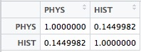

Problem info:
Name: Correlation and Regression Lines - A Quick Recap #1

Link: https://www.hackerrank.com/challenges/correlation-and-regression-lines-6

Difficulty: Medium


**OUTPUT**
0.145


**Description**
The Problem is about computing the Karl **Pearson correlation coeffecient** for a given data The data is the scores of two subjects **PHYSICS** and **HISTORY**.

First of all, I put the data inside a CSV file.


Secondly, I read the csv spreadsheet file to a variable named **data**. Thanks god there's a Correlation coeffecient ready-to-use function that i've used **cor()**

```r
data <- read.csv(file="data.csv");    #saving our input data to a var "data"
newdata <- cor(data);
```

Then, I've saved the Corr. coeff. result between the physics and history scores in a var **cf**.



Lastly, I print out the result formatted as **x.xxx** by the function **round** and **format**.

```r
cat(format(round(cf, 3), nsmall = 3));
```


**Note**: You can just print the output to HackerRank judge to pass. 
