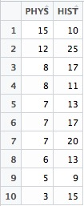

**OUTPUT**
0.145

**Description**
The Problem is about computing the Karl **Pearson correlation coeffecient** for a given data The data is the scores of two subjects **PHYSICS** and **HISTORY**.

First of all, I put the data inside a CSV file.

